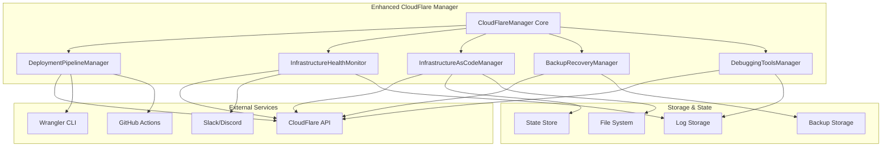

# Design Document

## Overview

The CloudFlare Infrastructure Automation enhancement extends the existing CloudFlareManager.ts with advanced deployment pipelines, monitoring capabilities, infrastructure-as-code management, and disaster recovery features. The design builds upon the current architecture while adding new modules for automation, monitoring, backup/recovery, and debugging.

The solution follows a modular architecture pattern, extending the existing CloudFlareManager class with specialized managers for different concerns. This approach maintains backward compatibility while providing powerful new capabilities for the SpaceVision app's infrastructure management.

### SpaceVision Workspace Structure

The SpaceVision app follows a monorepo structure with npm workspaces:

- **`worker/`**: CloudFlare Workers backend code (API, AI processing, database operations)
- **`web/`**: React frontend PWA (TypeScript, Vite, Tailwind CSS)
- **`shared/`**: Shared TypeScript types, utilities, and common code
- **`scripts/`**: Deployment and utility scripts
- **`tests/`**: End-to-end and integration tests

The enhanced CloudFlare Manager will respect this workspace structure and coordinate deployments across all workspaces in the correct dependency order (shared → worker/web → tests).

### Local Development Environment Setup

The enhanced system will provide streamlined onboarding for new developers:

#### Developer Onboarding Flow
1. **Environment Detection**: Automatically detect if this is a fresh clone
2. **Dependency Installation**: Guide through Node.js, npm, and Wrangler CLI setup
3. **CloudFlare Account Setup**: Help configure CloudFlare credentials and development resources
4. **Local Resource Provisioning**: Automatically create development KV namespaces, D1 databases, and R2 buckets
5. **Environment Configuration**: Generate and validate `.env` files for all workspaces
6. **Development Server Startup**: Launch all services in development mode with hot reloading

#### Local Development Features
- **One-Command Setup**: `npm run setup:dev` handles complete environment setup
- **Development Resource Isolation**: Each developer gets isolated CloudFlare resources
- **Hot Reloading**: Changes in shared/ automatically rebuild dependent workspaces
- **Local Testing**: Run full test suite against local CloudFlare development resources
- **Development Monitoring**: Local dashboard showing service health and logs
- **Quick Reset**: `npm run reset:dev` cleans and rebuilds entire development environment

## Architecture

### High-Level Architecture



### Component Architecture

The design extends the existing CloudFlareManager with six specialized managers:

1. **DeploymentPipelineManager**: Handles automated deployments and CI/CD integration
2. **InfrastructureHealthMonitor**: Provides real-time monitoring and alerting
3. **InfrastructureAsCodeManager**: Manages infrastructure declaratively with version control
4. **BackupRecoveryManager**: Handles automated backups and disaster recovery
5. **DebuggingToolsManager**: Provides advanced debugging and troubleshooting capabilities
6. **DeveloperOnboardingManager**: Streamlines local development setup for new developers

## Components and Interfaces

### 1. DeploymentPipelineManager

**Purpose**: Automates the entire deployment process for the SpaceVision app across all environments.

**Key Interfaces**:
```typescript
interface DeploymentConfig {
  environment: Environment;
  workspaces: string[];
  buildOrder: string[];
  environmentVariables: Record<string, string>;
  cloudflareResources: CloudFlareResourceConfig;
  rollbackStrategy: RollbackStrategy;
  notifications: NotificationConfig;
}

interface DeploymentResult {
  success: boolean;
  deploymentId: string;
  timestamp: string;
  environment: Environment;
  artifacts: DeploymentArtifact[];
  rollbackInfo?: RollbackInfo;
  errors?: DeploymentError[];
}

interface RollbackStrategy {
  automatic: boolean;
  maxRetries: number;
  healthCheckTimeout: number;
  rollbackTriggers: string[];
}
```

**Core Methods**:
- `deployApplication(config: DeploymentConfig): Promise<DeploymentResult>`
- `rollbackDeployment(deploymentId: string): Promise<void>`
- `validateDeployment(deploymentId: string): Promise<ValidationResult>`
- `getDeploymentHistory(environment: Environment): Promise<Deployment[]>`

### 2. InfrastructureHealthMonitor

**Purpose**: Continuously monitors all CloudFlare services and provides real-time health status.

**Key Interfaces**:
```typescript
interface HealthCheckConfig {
  services: ServiceHealthCheck[];
  alerting: AlertingConfig;
  metrics: MetricsConfig;
  thresholds: PerformanceThresholds;
}

interface ServiceHealthCheck {
  service: CloudFlareService;
  endpoint?: string;
  interval: number;
  timeout: number;
  retries: number;
  healthCriteria: HealthCriteria;
}

interface HealthStatus {
  service: CloudFlareService;
  status: 'healthy' | 'degraded' | 'unhealthy';
  lastCheck: string;
  responseTime: number;
  errors: HealthError[];
  metrics: ServiceMetrics;
}

interface AlertingConfig {
  channels: NotificationChannel[];
  escalation: EscalationPolicy;
  suppressionRules: SuppressionRule[];
}
```

**Core Methods**:
- `startMonitoring(config: HealthCheckConfig): Promise<void>`
- `stopMonitoring(): Promise<void>`
- `getHealthStatus(): Promise<HealthStatus[]>`
- `configureAlerts(config: AlertingConfig): Promise<void>`

### 3. InfrastructureAsCodeManager

**Purpose**: Manages CloudFlare infrastructure declaratively with version control and state management.

**Key Interfaces**:
```typescript
interface InfrastructureConfig {
  version: string;
  resources: CloudFlareResource[];
  dependencies: ResourceDependency[];
  variables: Record<string, any>;
  outputs: Record<string, any>;
}

interface CloudFlareResource {
  type: ResourceType;
  name: string;
  properties: Record<string, any>;
  dependencies?: string[];
  lifecycle?: ResourceLifecycle;
}

interface InfrastructureState {
  version: string;
  resources: ResourceState[];
  lastModified: string;
  checksum: string;
  locked: boolean;
}

interface DeploymentPlan {
  toCreate: CloudFlareResource[];
  toUpdate: ResourceUpdate[];
  toDelete: CloudFlareResource[];
  dependencies: string[][];
}
```

**Core Methods**:
- `plan(config: InfrastructureConfig): Promise<DeploymentPlan>`
- `apply(plan: DeploymentPlan): Promise<InfrastructureState>`
- `destroy(resources?: string[]): Promise<void>`
- `import(resourceType: string, resourceId: string): Promise<void>`

### 4. BackupRecoveryManager

**Purpose**: Provides automated backup and disaster recovery capabilities for all CloudFlare resources.

**Key Interfaces**:
```typescript
interface BackupConfig {
  schedule: CronExpression;
  retention: RetentionPolicy;
  resources: BackupResource[];
  storage: BackupStorage;
  encryption: EncryptionConfig;
}

interface BackupResource {
  type: CloudFlareService;
  identifier: string;
  backupStrategy: BackupStrategy;
  priority: number;
}

interface BackupResult {
  backupId: string;
  timestamp: string;
  resources: ResourceBackup[];
  size: number;
  checksum: string;
  encrypted: boolean;
}

interface RecoveryPlan {
  backupId: string;
  resources: ResourceRecovery[];
  dependencies: string[][];
  estimatedTime: number;
  risks: RecoveryRisk[];
}
```

**Core Methods**:
- `createBackup(config: BackupConfig): Promise<BackupResult>`
- `listBackups(filter?: BackupFilter): Promise<BackupResult[]>`
- `createRecoveryPlan(backupId: string): Promise<RecoveryPlan>`
- `executeRecovery(plan: RecoveryPlan): Promise<RecoveryResult>`

### 5. DebuggingToolsManager

**Purpose**: Provides advanced debugging and troubleshooting capabilities for the SpaceVision app.

**Key Interfaces**:
```typescript
interface DebuggingSession {
  sessionId: string;
  environment: Environment;
  services: CloudFlareService[];
  filters: LogFilter[];
  startTime: string;
  active: boolean;
}

interface LogFilter {
  service?: CloudFlareService;
  level?: LogLevel;
  timeRange?: TimeRange;
  searchTerms?: string[];
  traceId?: string;
}

interface PerformanceProfile {
  service: CloudFlareService;
  timeRange: TimeRange;
  metrics: PerformanceMetric[];
  bottlenecks: Bottleneck[];
  recommendations: OptimizationRecommendation[];
}

interface TroubleshootingReport {
  issue: string;
  severity: 'low' | 'medium' | 'high' | 'critical';
  affectedServices: CloudFlareService[];
  rootCause?: string;
  resolution?: string;
  preventionSteps?: string[];
}
```

**Core Methods**:
- `startDebuggingSession(config: DebuggingConfig): Promise<DebuggingSession>`
- `streamLogs(sessionId: string): AsyncIterator<LogEntry>`
- `analyzePerformance(service: CloudFlareService): Promise<PerformanceProfile>`
- `generateTroubleshootingReport(issue: string): Promise<TroubleshootingReport>`

### 6. DeveloperOnboardingManager

**Purpose**: Streamlines local development setup and onboarding for new developers joining the SpaceVision project.

**Key Interfaces**:
```typescript
interface OnboardingConfig {
  developerName: string;
  environment: 'development';
  workspaces: WorkspaceConfig[];
  cloudflareResources: DevelopmentResourceConfig;
  setupSteps: OnboardingStep[];
}

interface WorkspaceConfig {
  name: string;
  directory: string;
  dependencies: string[];
  buildCommand?: string;
  devCommand?: string;
  environmentVariables: Record<string, string>;
}

interface DevelopmentResourceConfig {
  kvNamespaces: string[];
  d1Databases: string[];
  r2Buckets: string[];
  workerRoutes: string[];
  isolationPrefix: string; // e.g., "dev-john-"
}

interface OnboardingStep {
  id: string;
  name: string;
  description: string;
  required: boolean;
  validator: () => Promise<boolean>;
  executor: () => Promise<void>;
  rollback?: () => Promise<void>;
}

interface DevelopmentEnvironment {
  developerId: string;
  resources: CloudFlareResource[];
  status: 'initializing' | 'ready' | 'error';
  services: DevelopmentService[];
  createdAt: string;
}
```

**Core Methods**:
- `initializeOnboarding(config: OnboardingConfig): Promise<OnboardingSession>`
- `setupDevelopmentEnvironment(developerId: string): Promise<DevelopmentEnvironment>`
- `validateEnvironment(developerId: string): Promise<ValidationResult>`
- `resetDevelopmentEnvironment(developerId: string): Promise<void>`
- `generateDeveloperGuide(): Promise<string>`

## Data Models

### Configuration Models

```typescript
interface CloudFlareResourceConfig {
  workers: WorkerConfig[];
  pages: PagesConfig[];
  kvNamespaces: KVConfig[];
  r2Buckets: R2Config[];
  d1Databases: D1Config[];
  dnsRecords: DNSConfig[];
}

interface WorkerConfig {
  name: string;
  script: string;
  workspaceDir: 'worker/'; // All workers in worker/ directory
  bindings: WorkerBinding[];
  routes: WorkerRoute[];
  environment: Environment;
}

interface PagesConfig {
  name: string;
  buildCommand: string;
  outputDirectory: string;
  workspaceDir: 'web/'; // Frontend in web/ directory
  environmentVariables: Record<string, string>;
  customDomains: string[];
}
```

### State Models

```typescript
interface DeploymentState {
  deploymentId: string;
  environment: Environment;
  status: DeploymentStatus;
  resources: ResourceState[];
  rollbackInfo: RollbackInfo;
  createdAt: string;
  updatedAt: string;
}

interface ResourceState {
  type: ResourceType;
  name: string;
  id: string;
  status: ResourceStatus;
  properties: Record<string, any>;
  dependencies: string[];
  lastModified: string;
}
```

## Error Handling

### Error Categories

1. **Configuration Errors**: Invalid or missing configuration parameters
2. **Authentication Errors**: CloudFlare API authentication failures
3. **Resource Errors**: CloudFlare resource creation/modification failures
4. **Network Errors**: Connectivity issues with CloudFlare services
5. **State Errors**: Infrastructure state inconsistencies
6. **Backup Errors**: Backup creation or restoration failures

### Error Handling Strategy

```typescript
interface ErrorHandler {
  handleError(error: Error, context: ErrorContext): Promise<ErrorResolution>;
  retryOperation(operation: () => Promise<any>, config: RetryConfig): Promise<any>;
  escalateError(error: Error, escalationLevel: number): Promise<void>;
}

interface ErrorResolution {
  resolved: boolean;
  action: 'retry' | 'rollback' | 'escalate' | 'ignore';
  message: string;
  nextSteps?: string[];
}
```

### Retry Logic

- Exponential backoff for transient failures
- Circuit breaker pattern for persistent failures
- Dead letter queue for failed operations
- Automatic rollback for critical failures

## Testing Strategy

### Unit Testing

- Test each manager class independently
- Mock CloudFlare API responses
- Test error handling scenarios
- Validate configuration parsing

### Integration Testing

- Test end-to-end deployment workflows
- Validate CloudFlare API integration
- Test backup and recovery procedures
- Verify monitoring and alerting

### Performance Testing

- Load test deployment pipelines
- Stress test monitoring systems
- Validate backup performance
- Test concurrent operations

### Security Testing

- Validate credential handling
- Test access control mechanisms
- Verify encryption implementation
- Audit logging capabilities

## Security Considerations

### Credential Management

- Store API keys in secure environment variables
- Implement credential rotation
- Use least-privilege access principles
- Audit credential usage

### Data Protection

- Encrypt backups at rest and in transit
- Implement secure communication channels
- Sanitize logs to remove sensitive data
- Implement data retention policies

### Access Control

- Role-based access control for operations
- Multi-factor authentication for critical operations
- Audit trail for all infrastructure changes
- IP-based access restrictions

## Performance Considerations

### Scalability

- Parallel execution of independent operations
- Batch processing for bulk operations
- Connection pooling for API calls
- Caching for frequently accessed data

### Optimization

- Lazy loading of resources
- Compression for data transfer
- Efficient state management
- Resource cleanup and garbage collection

### Monitoring

- Performance metrics collection
- Resource utilization tracking
- Response time monitoring
- Error rate tracking